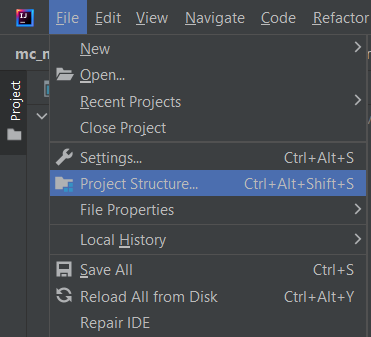
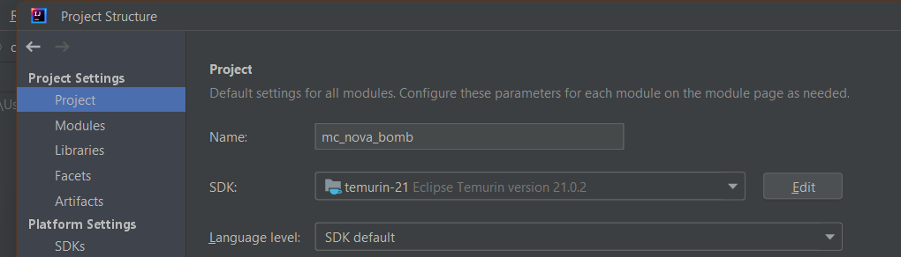
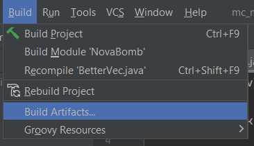
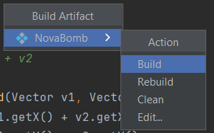

# Particles (Minecraft plugin)


# Requirements

Java 21 or higher is needed to run this plugin. You can find a list of multiple Java versions to download [here](https://adoptium.net/temurin/releases/).

You'll also need a server compatible with Bukkit. The plugin was built for version 1.20.6, so it's recommended to use that version. This plugin was built using the Bukkit API provided by [Paper](https://papermc.io/downloads/paper). A [Spigot](https://hub.spigotmc.org/jenkins/job/BuildTools/) server should also work since paper-specific APIs were not used. The process to get a Spigot server downloaded and running is a little bit more involved than a Paper server, so if you are on the fence between the two, Paper will be easier to setup.


# How to use

Download the latest release and put it in the plugins folder of your Minecraft server. Restart the server. The plugin should now appear on the plugins list (use the /plugins command).

Once you see the plugin in the list, you can spawn particles by using the command /particles, or its alias, /part. The tab completion menu will show you which options you can use.

The format for the command is:

```
/<command> [<player>] <start/stop> [<particle> <pattern> <trajectory>]
```

If you use "stop" as the option for start/stop, then the command ends there. However, if "start" is used, the rest of the arguments are required. Here are a few examples:

```
/part start happy_villager double_helix orbit_player

/part stop 
```

If you want to apply or cancel particle effects for another player, or if you are running the command from the console to apply particle effects to a player, you must specify the player name of a player who is online. Here are a few examples:

```
/part Bob start cherry_leaves basic straight_and_bounce

/part Bob stop
```


# How to compile

If you want to make changes, download [IntelliJ Community Edition](https://www.jetbrains.com/idea/download/). Clone this project and open it in IntelliJ. Once you've done that, ensure that the project is setup to use Java 21 in Project Settings.

You can get to the Project Settings menu by going to File > Project Structure:



Then, make sure Project is selected on the left sidebar. In this menu, make sure SDK is set to a JDK that is version 21. This version of Java is needed to run a Minecraft server that is version 1.20.6.



If IntelliJ is giving you a bunch of errors because it can't find Bukkit classes like JavaPlugin, Material, and Action, you may also need to refresh Maven to get it to download the dependencies.

Once the project is setup, you can build it using the Build Artifact:



A menu will popup. Click Build. By default, this should place a jar file in an `out` directory in your project.



Move the new jar file into the plugins folder of your Minecraft server. If you want to speed up the process of building and testing, click Edit in the Build Artifact menu instead of Build, and then change the output directory to the plugins folder of your server.